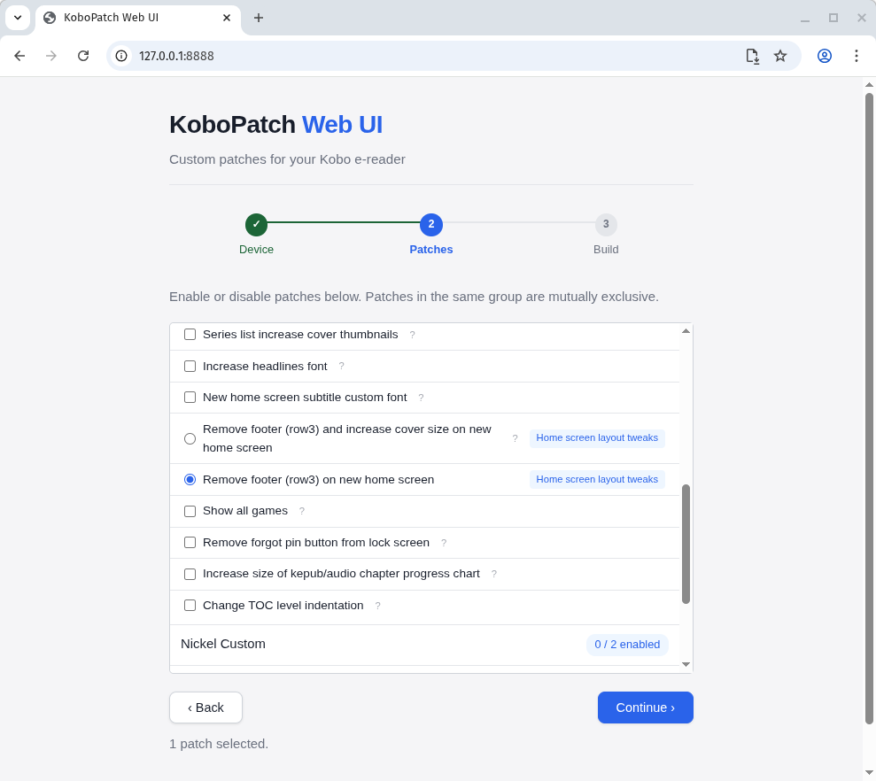

# KoboPatch Web UI

> [!IMPORTANT]
> **This is an experiment**, mostly created with the help of Claude and some very precise instructions. Until I can validate that this project consistently outputs identically patched files to the local binaries and I am confident the patcher works as expected, this message will remain.

A web application that provides a GUI for applying custom [kobopatch](https://github.com/pgaskin/kobopatch) patches to Kobo e-readers. It uses the File System Access API (Chromium) to interface with connected Kobo devices, or falls back to manual model/firmware selection on other browsers.



The app makes it easy to configure which patches to apply, downloads the correct firmware from Kobo's servers, runs the patcher (compiled to WebAssembly), and places the resulting `KoboRoot.tgz` on the device. The user then reboots to apply.

Fully client-side — no backend needed, can be hosted as a static site. Patches are community-contributed via [MobileRead](https://www.mobileread.com/) and need to be manually updated when new Kobo firmware versions come out.

## User flow

1. Select device (auto-detect via File System Access API on Chromium, or manual dropdowns on any browser)
2. Configure patches (enable/disable, PatchGroup mutual exclusion via radio buttons)
3. Build — firmware auto-downloaded from Kobo's CDN (`ereaderfiles.kobo.com`, CORS open), patched via WASM in a Web Worker
4. Write `KoboRoot.tgz` to device (Chromium auto mode) or download manually

## File structure

```
src/public/                     # Webroot — serve this directory
  index.html                    # Single-page app, 3-step wizard (Device → Patches → Build)
  style.css
  app.js                        # Step navigation, flow orchestration, firmware download with progress
  kobo-device.js                # KOBO_MODELS (serial prefix → name), FIRMWARE_DOWNLOADS (version+prefix → URL),
                                #   getDevicesForVersion(), getFirmwareURL(), KoboDevice class (File System Access API)
  patch-ui.js                   # PatchUI class: loads patch zips (JSZip), parses YAML, renders toggle UI,
                                #   generates kobopatch.yaml config with overrides
  kobopatch.js                  # KobopatchRunner: spawns Web Worker per build, handles progress/done/error messages
  patch-worker.js               # Web Worker: loads wasm_exec.js + kobopatch.wasm, runs patchFirmware(),
                                #   posts progress back, transfers result buffer zero-copy
  wasm_exec.js                  # Go WASM support runtime (copied from Go SDK by setup.sh, gitignored)
  kobopatch.wasm                # Compiled WASM binary (built by build.sh, gitignored)
  patches/
    index.json                  # [{ "version": "4.45.23646", "filename": "patches_4.45.23646.zip" }]
    patches_*.zip               # Each contains kobopatch.yaml + src/*.yaml patch files

kobopatch-wasm/                 # WASM build
  main.go                       # Go entry point: jsPatchFirmware() → patchFirmware() pipeline
                                #   Accepts configYAML, firmwareZip, patchFiles, optional progressFn
                                #   Returns { tgz: Uint8Array, log: string }
  go.mod
  setup.sh                      # Clones kobopatch source, copies wasm_exec.js
  build.sh                      # GOOS=js GOARCH=wasm go build, copies .wasm to src/public/,
                                #   sets ?ts= cache-bust timestamp in patch-worker.js
```

## Adding a new firmware version

1. Add the patch zip to `src/public/patches/` and update `index.json`
2. Add firmware download URLs to `FIRMWARE_DOWNLOADS` in `kobo-device.js` (keyed by version then serial prefix)
3. The kobo CDN prefix per device family (e.g. `kobo12`, `kobo13`) is stable; the date path segment changes per release

## Building the WASM binary

Requires Go 1.21+.

```bash
cd kobopatch-wasm
./setup.sh    # first time only
./build.sh    # compiles WASM, copies to src/public/
```

## Running locally

```bash
python3 -m http.server -d src/public/ 8888
```

## Output validation

The WASM patcher performs several checks on each patched binary before including it in the output `KoboRoot.tgz`:

- **File size sanity check** — the patched binary must be exactly the same size as the input. kobopatch does in-place byte replacement, so any size change indicates corruption.
- **ELF header validation** — verifies the magic bytes (`\x7fELF`), 32-bit class, little-endian encoding, and ARM machine type (`0x28`) are intact after patching.
- **Archive consistency check** — after building the output tar.gz, re-reads the entire archive and verifies the sum of entry sizes matches what was written.

## Credits

kobopatch by [pgaskin](https://github.com/pgaskin/kobopatch). Patches from [MobileRead](https://www.mobileread.com/).
